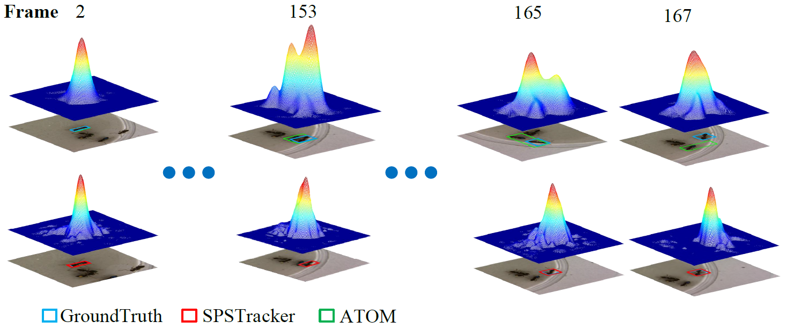
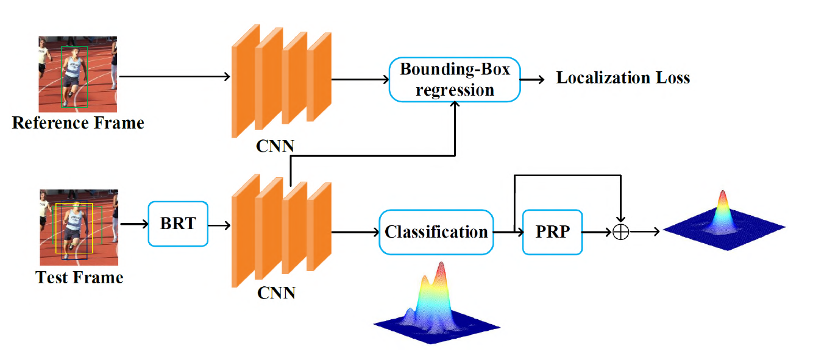

# [SPSTracker: Sub-Peak Suppression of Response Map for Robust Object Tracking](https://arxiv.org/abs/1912.00597).


## News
* \[2019/11/11\] SPSTracker is has been accepted for presentation at the Thirty-Fourth AAAI Conference on Artificial Intelligence (AAAI-20).
## Introduction
This is the official code of SPSTracker: Sub-Peak Suppression of Response Map for Robust Object Tracking. We propose a simple-yet-effective approach, referred to as SPSTracker for robust object tracking. Our motivation is based on the observation that most failure tracking is caused by the interference around the target. Such interference produces multi-peak tracking response, and the sub-peak may progressively ``grow" and eventually cause model drift. Therefore ,we propose suppressing the sub-peaks to aggregating a single-peak response, with the aim of preventing model drift from the perspective of tracking response regularization. 



## Installation 
Code is implemented upon the ATOM architecture, check [INSTALL.md](INSTALL.md) for installation instructions.

## Results

|                           <sub>Tracker</sub>                           |      <sub>VOT2016</br>EAO /  A / R</sub>     |      <sub>VOT2018</br>EAO / A / R</sub>      | 
|:----------------------------------------------------------------------:|:--------------------------------------------:|:--------------------------------------------:|
| <sub>SPSTracker</sub> |       <sub>0.459/0.625/0.158</sub>       |       <sub>0.434/0.612/0.169</sub>       |


## Citations
Please consider citing our paper in your publications if the project helps your research.
```
@inproceedings{hu2020spstracker,
  title   =  {{SPSTracker}: Sub-Peak Suppression of Response Map for Robust Object Tracking},
  author  =  {Qintao Hu and Lijun Zhou and Xiaoxiao Wang and Yao Mao and Jianlin Zhang and Qixiang Ye},
  booktitle =  {Thirty-Fourth AAAI Conference on Artificial Intelligence (AAAI)},
  year    =  {2020}
}
```
